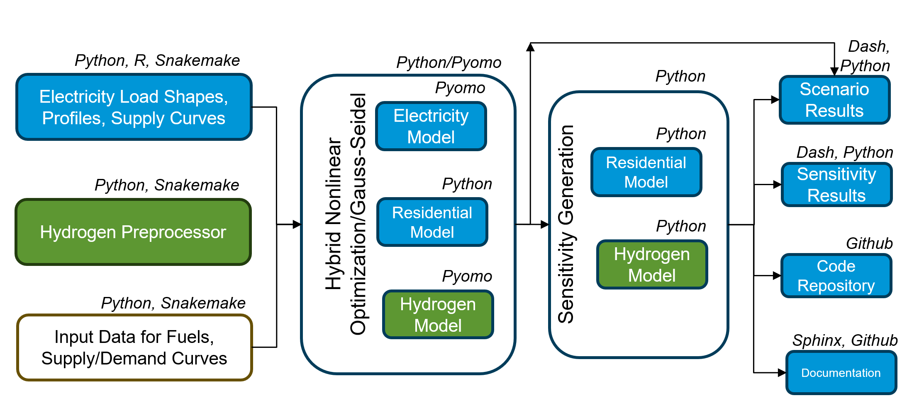
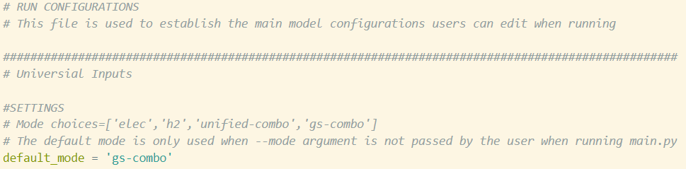

# BlueSky Prototype

- [BlueSky Prototype](#bluesky-prototype)
    - [Description](#description)
        - [Prototype Capabilities](#prototype-capabilities)
        - [Modules](#modules)
        - [Model Complexity and Computational Efficiency](#model-complexity-and-computational-efficiency)
    - [Documentation](#documentation)
        - [Model Documentation](#model-documentation)
        - [Code Documentation](#code-documentation)
        - [Integration Documentation](#integration-documentation)
    - [Visuals](#visuals)
    - [Set-Up](#set-up)
        - [Installation](#installation)
        - [Gitbash and bat file Method](#gitbash-and-bat-file-method)
    - [Usage](#usage)
        - [First Run](#first-run)
        - [Overview](#overview)
    - [Support](#support)
    - [Contributing](#contributing)
        - [Steps to Contribute](#steps-to-contribute)
        - [Guidelines](#guidelines)
    - [Authors and acknowledgment](#authors-and-acknowledgment)
    - [License](#license)
    - [Project status](#project-status)


## Description
[Project BlueSky](https://www.eia.gov/totalenergy/data/bluesky/) is an EIA initiative to develop our next generation energy systems model, which will eventually be used to produce the Annual Energy Outlook (AEO) and International Energy Outlook (IEO). The new model will be designed to address the complexity and interconnectivity of the modern world and the uncertainty associated with markets, technologies, and international trade.

The BlueSky Prototype is the first step towards creating this next generation model. Our objective in releasing the prototype is to give modelers a chance to experiment with the new framework. Feedback gathered from stakeholders will be used to develop a full-scale version of the model beginning in 2025.

The design goal of the BlueSky prototype is to implement a computationally efficient, modular structure that allows each sector to flexibly capture the underlying market dynamics using the different mathematical formulations.

The prototype represents a demonstration of this new, computationally efficient, and modular structure. In addition to the core mathematical model, the prototype demos a pipeline for input data processing, documentation, and approximating model sensitivity.

Given our focus, the prototype includes the following:
* Three modules representing distinct electricity, hydrogen, and residential sectors rather than the 14 modules contained in the current version of National Energy Modeling System (NEMS).
* Individual modules built upon governing dynamics from NEMS, excluding significant advancements in energy system representation. 
* A generic energy system representation, excluding any specific country, region, or timeframe. Static outputs associated with non-modeled sectors are incorporated in the prototype to make it functional.

The prototype is NOT meant to represent or produce meaningful energy modeling outputs. It is designed to obtain feedback from the energy modeling community on the mathematical formulation and code implementation for the next generation energy systems model. 

We anticipate several years of development to turn the prototype into a production model, like NEMS
Post prototype development will require close collaboration among stakeholders.

### Prototype Capabilities
The BlueSky Prototype has the following advancements in the mathematical formulation: 
* Provides two options for solving the model to equilibrium: 1) Gauss-Seidel iteration and 2) A hybrid optimization-iteration method
* Includes nonlinear price responses in the residential module and endogenous nonlinear learning in the electricity module.
* Includes approximation methods that output the sensitivity of the solution with respect to uncertain inputs. 

The BlueSky Prototype has the following advancements in the code implementation: 
* Open-source code under an Apache 2.0 license built primarily on Python with the capability to be used with free solvers. 
* Written in a modular structure that allows modules to be run independently and also allows easy addition of modules. 
* Modules also have a modular “block” structure programmed in Pyomo that allows swapping of model capabilities.
* Flexibility to run under different temporal and spatial granularities and technological learning capabilities so the model size and complexity can be adjusted.
* A data pipeline and workflow process for input data into the model. The prototype separates the data from the modeling, allowing the flexibility of diverse data inputs without hardcoding.
* Efficient implementation using sparse indexing, mutable parameters, and shared variables in simultaneous optimization to speed up computation.
* A generic methodology for converting non-optimization formulations into optimization formulations with the Residential module as an example.
* Detailed and automated documentation.

Each of the individual modules, including the integrator, shows these capabilities highlighted above.

Note that the prototype only contains basic output visualization capabilities. This is because the prototype is not meant to include any capabilities of producing results that need to be analyzed. 


### Modules
Long-term models at EIA (NEMS and WEPS) should be thought of as a collection of modules as opposed to a consistent, combined model. Each sector needs its own governing dynamics, and thus its own mathematical formulation and code implementation. The modules in the prototype have been deliberately designed to mimic these differences among modules and among teams at EIA. Thus, while the prototype does strive to achieve some consistency in coding, the modules have their own mathematical formulation and code implementation that can seem different. We encourage you to explore these differences and give us feedback on their implementation.

We have also implemented two different methods for integration, with documentation linked below. The "integration" module is on the same levels as the modules and uses copies of the modules within its own folder. The "integrator" is a level above the modules and calls on the modules from their respective folders. It also allows standalone runs of the modules. We are currently testing both methods and aim to have a single method for release. You are welcome to provide feedback on both.

### Model Complexity and Computational Efficiency
The prototype provides three features that address model complexity and make solving the model more efficient than the current setup in NEMS/WEPS:
1. The computational modeling is programmed in Python, which allows models and data to be run concurrently in the same language and hold information in memory. The complexity of opening different software, running modules independently, and exchanging data not in memory is eliminated.
2. The prototype provides two different methods to solve the integrated model. The Gauss-Seidel method is made efficient through the first step of calling Python models through a Python script and storing information that has to be passed through in memory. Further, in the Gauss-Seidel and other iterative methods in the prototype (such as the linearization of nonlinear learning in the Electricity module) the starting point for the next iteration is already stored in memory and speeds up computation. This can be seen when looking at the times for iterative solves for the modules, which decrease as the iterations progress. The second method, a unified optimization method, integrates the modules into one mathematical structure that can contain a potentially diverse set of governing dynamics. Theoretically, if an efficient mathematical structure can be found, these methods are computationally more efficient than iterative methods of achieving equilibrium.  For example, in solving formulations with multiple players, iterative methods such as Gauss-Seidel (also referred to as diagonalization in the literature) tend to converge slower than combining problems into a nonlinear optimization problem ([Leyffer and Munson, 2010](https://www.tandfonline.com/doi/abs/10.1080/10556780903448052); [Ralph and Smeers, 2006](https://ieeexplore.ieee.org/abstract/document/4075721)). They take advantage of the mathematical structure of individual modules to produce a larger problem where the existence and uniqueness properties can be studied. The prototype shows this as the unified optimization method solves problems zzz times faster.
3. The prototype is flexible on the number of regions and years it needs to solve for, both in the modules and in integrated solves. The prototype can also be started in later years and does not need a particular starting and stopping year. This flexibility allows testing new complexity additions on small versions of the model without having to test on a full version.

 

## Documentation

Documentation for each of the modules are below. We also include documentation for a sample data workflow tool we have implemented and would love feedback on.

### Model Documentation
* [Electricity Module](src/models/electricity/README.md)
* [Hydrogen Module](src/models/hydrogen/README.md)
* [Residential Module](src/models/residential/README.md)
* [Data Workflow](sample/data_pipeline/README.md)


### Code Documentation

[Instructions for HTML, Markdown, and PDF documentation](docs/README.md)


### Integration Documentation
We also have documentation for two drafts of how we intend to solve the modules together. Note, these are under development and don't have full functionality yet. We would appreciate feedback on both and which aspects of each are easy to understand. 
* [Integration Module with Pyomo Blocks (Only tested on 1 region, two years)](sample/integration/README.md)
* [Integrator Module with Pyomo Concrete Models (Only tested on 3 regions, four years)](src/integrator/README.md)


## Visuals



## Set-Up

To set up the appropriate Python environment, you will need to install the following from the EIA Software Center:
* Anaconda (or Miniconda 3)
* Python 3.12
* Git
* VSCode
* TortoiseGit (Optional)

### Visual Studio Code Method

1. **Clone the bluesky_prototype repo** 

```base
https://github.com/EIAgov/BlueSky.git
```

2. **Set up VSCode**
   * Open VSCode and navigate to the **bluesky_prototype** repository

   * Press `ctrl+shift+P` and search for *Python: Select Interpreter*. Select any Conda Environment listed. I recommend selecting the `"(Base)"` environment. If none are available, check whether you have Anaconda (or Miniconda) installed on your machine.

   * Press `ctrl+shift+P` and search for *Terminal: Select Default Profile*. Select `Command Prompt`.

   * Open a new terminal by pressing `` ctrl+shift+` ``

   * Check to see if this terminal is Conda-enabled; it should say `(Base)` or the name of the conda environment you have chosen as your Python interpreter

3. **Create the 'bsky' Conda environment**
   * The libraries needed to run any bluesky module are contained in the `bsky` conda environment described in conda_env.yml

      - If you are working from a terminal within VSCode, use this terminal to execute the commands in the next few steps

   * Check existing environments and run `conda info --envs`

   * If "bsky" does not exist on your machine...
      - Run `conda env create -f conda_env.yml` in your terminal to create the environment
      - Run `conda activate bsky` to activate the environment

   * If "bsky" does exist on your machine...
      - Execute `conda activate bksy` to activate your environment
      - Run `conda env update --file conda_env.yml --prune` to check for updates
   
   * If the installation is corrupted and the environment will not activate
      - Run `conda remove -n bsky --all` to remove
      - Reinstall as if the environment does not exist as described above!

4. **Some libraries used are not available in Conda-Forge. Once activated, use pip to install the following non-Conda libraries**
   * `pip install highspy`

5. **You are ready to run the model!** If you've already created the environment, you only need to activate the environment upon your next session

### Gitbash and bat file Method

1. **Clone the bluesky_prototype repo** 

```base
git clone https://github.com/EIAgov/BlueSky.git
```


2. Open the `env-setup.bat` file in a text editor (**VS-Code** or **Notepadd++**)

3. Edit the **.bat** file and paste in the path to your `active.bat` in your anaconda installation on your computer *highlighted below 

```bash

call "C:\PATH-TO-ANACONDA\user\anaconda3\condabin\activate.bat"

```

4. Edit the **.bat** file and paste in the directory path to your cloned repo

```bash

cd "C:\PATH-TO-BLUSKY_REPO\gh_repos_n\bluesky_prototype" && conda env create -f conda_env.yml && conda activate bsky && pip install highspy


```
5. Save the file, and run it by double clicking on the file. 

6. You are ready to run the model using the **bsky** environment. 


## Usage

### First Run

Let's test the installation! 

'main.py' is the control script that, when executed, imports and runs methods contained within the integrator module to instantiate, build, and solve models. Be sure to have 'bsky' activated in a terminal, navigate to the 'bluesky_prototype' directory in your terminal, and then run the following code:
 
```bash
python main.py --help
```
This should return a description of 'main.py', as well as the options available within the command line interface. Now, check to see if we can run and solve a model by executing:

```bash
python main.py --mode elec
```

If this reports an objective value, you have successfully run the electricity model in standalone! The pattern is the same for running other versions/methods of the model, including integrated runs.

We can declare the mode using ['run_config.toml'](src/integrator/run_config.toml) by changing the 'default_mode'. Navigate to this file and change the option for default mode from 'gs-combo' to 'unified-combo'.



Then, run 'main.py' without specifiying a mode:

```bash
python main.py
```

### Overview

The [Integrator Module](src/integrator/README.md) contains the methods you use to run modules in standalone and integrated modes. You can access and run these methods via ['main.py'](main.py) in the parent directory. All should be run from the top-level of the project via the 'main.py' file.  Running `python main.py --help` will display the mode options.

One of the goals of the prototype is to streamline control of model builds and allow for easily-accessible customization of runs. The majority of the options for both standalone and integrated model runs rely upon a configuration file located in the integrator folder: ['run_config.toml'](src/integrator/run_config.toml). 
 
Here you can find the file paths pointing to regions/years to synchronize the models. These switch (sw) files ([sw_reg for regions]('src/integrator/input/sw_reg.csv') and [sw_year for years]('src/integrator/input/sw_year.csv')) can be modified to include or remove years and regions from your model build. This file will be built out further as we continue to develop the prototype.

You can also navigate to the [Hydrogen](src/models/hydrogen/README.md) and [Electricity](src/models/electricity/README.md) modules for more details about with them directly. 

See the `--help` command as described above to see the available modes! More information can be found in the [Integrator Module](src/integrator/README.md) readme file!


## Support

Please reach out to BlueSky team members for assistance:
`Sauleh.Siddiqui@eia.gov`
`Adam.Heisey@eia.gov`
`Cara.Marcy@eia.gov`
`James.Willbanks@eia.gov`
`Nina.Vincent@eia.gov`
`Mackenzie.Jones@eia.gov`
`Jonathan.Inbal@eia.gov`
`Brian.Cultice@eia.gov`


## Contributing


We welcome contributions to our project and appreciate your effort to improve it! To ensure a smooth and organized workflow, please follow these steps when contributing to the main repository on our internal GitLab account:

### Steps to Contribute

TO DO: add contribution instructions

### Guidelines

- **Documentation**: Update or add documentation as needed to explain your changes and how to use any new features.
- **Discussions**: Feel free to start a discussion if you have any questions or need clarification on any aspect of the project.

We appreciate your contributions and efforts to improve our project. Thank you for your collaboration!

If you have any questions or need further assistance, please don't hesitate to reach out to us.

## Authors and acknowledgment
`U.S. Energy Information Administration`

## License
The BlueSky code, as distributed here, is governed by [specific licenses](https://github.com/eiagov)

## Project status
Currently under development and review
