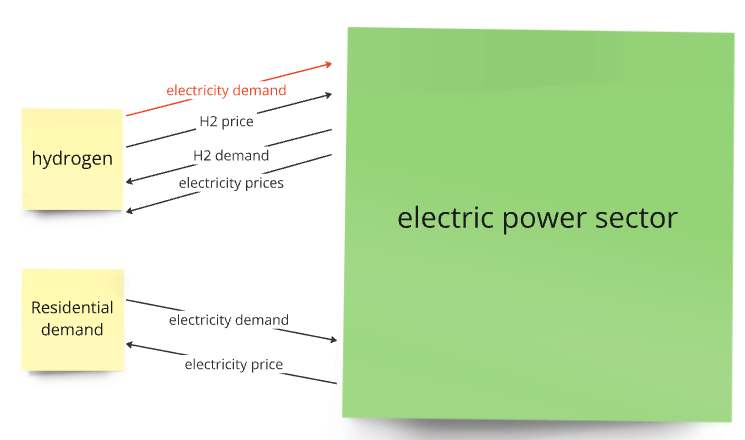
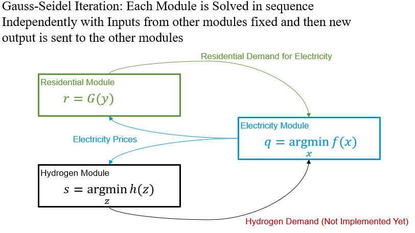
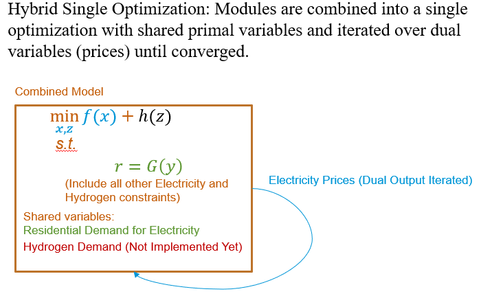

# Integration

- [Integration](#integration)
    - [Introduction](#introduction)
    - [Integration methods](#integration-methods)
    - [Prepare Data](#prepare-data)
    - [Model Formulation](#model-formulation)
        - [Summary](#summary)
        - [Nomenclature Table](#nomenclature-table)
            - [Mutable Parameters](#mutable-parameters)
            - [Variables](#variables)

## Introduction

This module provides computational methods to integrate the Electricity, Hydrogen, and Residential modules and solve for equilibrium. The module exchanges prices and quantities as in the figure below until values converge.

(Note, the electricity demand is in red font because we haven't fully integrated this yet, it requires some change to the timesteps for the Hydrogen module.)

## Integration methods
The prototype has two different methods to solve for equilibrium:

1. A Gauss-Seidel iteration method that mimics the current NEMS algorithm in a basic manner. The modules are solved iteratively with variables from other modules fixed as parameters until all modules converge.

2. A Hybrid approach by combining all modules into a single optimization problem and then iterating over dual variables until the values of the dual variables converge. 

[Mathematically](https://git.eia.gov/oea/nextgen-bluesky/bluesky_prototype/-/blob/main/src/models/integration/IterativeDuals.pdf), if both methods converge, the point they converge to is guaranteed to be an equilibrium. In our tests, the Hybrid single-optimization algorithm converges several times quicker computationally. 

## Prepare Data

The module is set to take in multiple csvs to declare the size of the model. Please refer to the H2 and electricity model pages for additional details on their set up. To date, this model has been verified on 1 region (region number 7), 2 years (2025 and 2026), and no learning in the electricity module (sw_learning = 0). Once these files are configured, the single optimization and Gauss-Seidel methods will run from the block_ecm_h2_residential_singleregiontest jupyter file.

## Model Formulation

### Summary

The integration module follows several steps to converge to a solution and the process differs for both the Single Optimization and Gauss-Seidel iteration procedure. 

For single optimization the process is as follows:
1. Create a parent block structure named model.3 which will house all modules
2. Create all mutable parameters which will include all information exchanged between modules show in the diagram above including: electricity price, H2 demand, H2 prices, and electricity demand
3. Create and run one instance of the electricity model 
4. Obtain dual values from demand constraint for initial values of electricity prices
5. Obtain electricity generated by H2 for initial values of H2 demand
6. Create and run one instance of the H2 model
7. Obtain dual values from demand constraint to get initial values of H2 prices 
8. Create the entire block structure of electricity, H2, and residential modules to run simultaneously
9. Add additional constraint ensuring residential demand is met
10. Solve all models and check tolerance
11. Iterate 3-10 until convergence

For Gauss-Seidel the process is as follows:
1. Create two parent block structure named model.1 which will house the H2 model and model.3 which will house the electricity and residential modules
2. Create all mutable parameters which will include all information exchanged between modules show in the diagram above including: electricity price, H2 demand, H2 prices, and electricity demand
3. Create and run one instance of the electricity model 
4. Obtain dual values from demand constraint for initial values of electricity prices
5. Obtain electricity generated by H2 for initial values of H2 demand
6. Create and run one instance of the H2 model
7. Obtain dual values from demand constraint to get initial values of H2 prices 
8. Create an instance of the residential module
10. Obtain residential load values to get initial values of load
11. Check tolerance 
12. Iterate from 3-9 until convergence

### Nomenclature Table

#### Mutable Parameters
| Parameter | Code     | How it's calculated    |  Where it's an input     | Short Description      | Index |
|:-----     | :------  | :---------    |  :---------    | :----------------      | :-----|
|$H2Price$ | model3.H2Price or model1.H2Price | Dual Value from H2 Model Demand Constraint | Electricity Model | Hydrogen Prices | $(region,season, time step, year)$ |
|$H2ElectricityPrice$ | model3.H2_electricity_price or model3.H2_electricity_price | Dual Value from Electricity Model Demand Constraint | H2 Model | Market Electricity Prices | $(region, year)$ |
|$H2Demand$ | model3.H2_Demand or model1.H2_Demand| H2 Generation from Electricity Model | H2 Model | Electricity Demanded from H2 | (region, year) |
|$Load$ | model3.Load or model1.Load | Calculated Load from Residential Model Function | Electricity Model | Residential Electricity Load | $(region,year,hour)$ |
|$ElectricityPrice$ | model3.electricity_price or model3.electricity_price | Dual Value from Electricity Model Demand Constraint | Residential Model | Market Electricity Prices | $(region, year, hour)$ |

#### Variables
| Variables | Code     |  Where it's used input     | Short Description      | Index |
|:-----     | :------  |   :---------    | :----------------      | :-----|
|$ElectricityGeneration$ | model3.second_block.Generation  | Electricity Model | Amount of Electricity Generated | $(region,season,technology, time step, year)$ |
|$Load$ | model3.third_block.Load  |  Residential Model | Amount of Residential Electricity Load | $(region, year, hour)$ |

