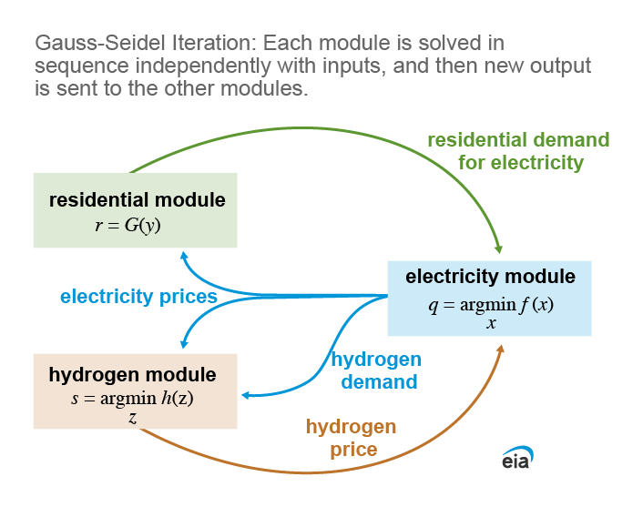

# Integration

- [Integration](#integration)
    - [Preface](#preface)
    - [Introduction](#introduction)
    - [Integration methods](#integration-methods)
    - [Mode Notes](#mode-notes)
    - [Modes](#modes)
    - [Run Configuration](#run-configuration)
            - [Integrator settings](#integrator-settings)
            - [Temporal settings](#temporal-settings)
            - [Spatial settings](#spatial-settings)
            - [Electricity settings](#electricity-settings)
    - [Tests](#tests)
    - [Logging](#logging)
    - [Code Documentation](#code-documentation)

## Preface
Finding an equilibrium solution among several modules requires exchanging information that is common between modules and/or having modules access information contained in another module. The Prototype chooses to find an equilibrium solution through this integrator module.

The essential common information that modules exchange is related to prices and quantities, which have to coincide among the modules for an equilibrium. Modules might exchange other information, such as updated marginal costs and discount rates, but mathematically, there's two types of variables exchanged between modules:
1. Primal Variables, or those that explicitly are defined within the problem, and exist as unknowns that the problem solves for. This mostly include prices.
2. Dual Variables, or those that are output once the problem is solved, but are not explicitly defined in the problem formulation. Examples of this are prices that are calculated from market clearning conditions in individual modules.

The Prototype shows generalizable methods to exchange both these pieces of information under two different methods to solve for an equilibrium. While the Prototype only displays specific examples, they are programmed in a generalized way so that modules can exchange any primal and dual variables within modules. The "Primal" and "Dual" terminology is borrowed from mathematical optimization, but can apply to any module depending on how the variables are defined. Note that any parameters could be exchanged as primal variables.

## Introduction

This module provides computational methods to integrate the Electricity, Hydrogen, and Residential modules and solve for equilibrium. The module exchanges prices (Dual Variables) and quantities (Primal Variables) as in the figure below until values converge.

(Note, the electricity demand is in red font because we haven't fully integrated this yet, it requires some change to the timesteps for the Hydrogen module.)

## Integration methods
The prototype has two different methods to solve for equilibrium:

1. A [Gauss-Seidel](https://en.wikipedia.org/wiki/Gauss%E2%80%93Seidel_method) iteration method that mimics the current NEMS algorithm in a basic manner. The modules are solved iteratively with variables from other modules fixed as parameters until all modules converge. 

2. A Hybrid approach by combining all modules into a single optimization problem and then iterating over dual variables until the values of the dual variables converge. 

[Mathematically](https://git.eia.gov/oea/nextgen-bluesky/bluesky_prototype/-/blob/main/src/models/integration/images/IterativeDuals.pdf), if both methods converge, the point they converge to is guaranteed to be an equilibrium. In our tests, the Hybrid single-optimization algorithm converges several times quicker computationally. Note that the Hydrogen demand is a primal variable, and in the unified optimization method, is coded as a variable that is shared in the overall problem. The Hydrogen price and Electricity price are dual variables and need to be iterated to obtain a solution, since they are only available after the optimization has been solved. Other primal and dual variables that are common between modules can be coded by the methodology presented here.

## Mode Notes

Various run modes are currently EXPERIMENTALLY developed and available

All should be run from the top-level of the project via the `main.py` file.  Running `python main.py --help` will display the mode options.  Users can choose to specify a mode when they run the main script, for example `python main.py --mode elec` or they can specify the mode in the `run_config.toml` file. See mode options below. 

## Modes

  |  Mode  |  Main File  |  Demonstrates   |
  | ---      | ---         | ---         | 
  | H2  | `h2_model.py` | Ability to solve the Hydrogen module independently.|
  | Elec | `electricity_model.py` | Ability to solve the Electricity module independently.|
  | Unified Combo | `unified_elec_hyd_res.py` | Iterativey solve a unified 3-way combination of modules (Electricity, Hydrogen, Residential). |
  | GS Combo | `gs_elec_hyd_res.py` | Apply Gauss-Seidel method to 3-way combination of modules (Electricity, Hydrogen, Residential). |

## Run Configuration

The majority of the options that solve things jointly rely upon a configuration file located in the integrator folder:  `run_config.toml`.  This file contains settings shared across modules as well as settings specific to each module.

#### Integrator settings

|Switch | Description   | Values     | Notes |
|:----- | :-----------: | :--------- | :---: |
|force_10 | Forces 10 iterations to occur when running combo solves | <code> false = Off   true = On </code> | Only allows for true/false options, does not impact H2 or elec modes |
| tol | Tolerance setting for iterative solves |  <code> 0 < tol < 1 </code> | Represents the acceptable percent difference in objective values between iterative solves needed to achieve convergence
| max_iter | Maximum number of iterations allowed | integer | If tolerance criteria is not met, iterative solves will stop +1 solve after max_iter
| sw_temporal | Temporal resolution (inter-annual) switch | <code> default = 16 representative (rep) days and 4 rep hours   d8h12 = 8 rep days and 12 rep hours   d4h24 = 4 rep days and 24 rep hours  <code>  |Temporal switch to select different prespecified temporal resolutions. Advanced users can also specify their own temporal resolution by creating their own “cw_s_day” and “cw_hr” files in the “src\integrator\input\temporal_mapping” directory

#### Temporal settings
This model has various temporal flexibility settings. The model runs a number of representative days (self-looping) with a number of periods (hour-several hours) per representative day. Any number of aggregated representative days can be used, but there must be at least 1 per season. The representative days and hours use a weighted average of inputs where necessary.

| Temporality | File | Description |
| :---------- | :--- | :---------- |
| Hours | cw_hr.csv | **Contains the representative hour mapping crosswalk**   <li> Index_hr represent each hour in a 24 hour period   <li> Map_hr is the representative hour number each Index_hr is being mapped to. Hours must be in chronological order.   <li> Map_hr 1 can wrap around from 24 to 1. |
| Days | cw_s_day.csv | **Contains the representative hour mapping crosswalk**   <li> Index_day is the day number of the year: 1-365   <li> Map_s is the season mapping of these days. *Note: Do not change this unless you need to make larger changes to the code because input files are based on the seasons*   <li> Map_day is the representative day that this Index_day is mapped to. Representative days are created using weighted averages of Index_day. *Note: You cannot have a representative day span multiple seasons.* |
| Years | sw_year.csv | **Contains the representative year mapping switches**   <li> Points to a csv file that contains switches for years being run. Runs the models for the years that are switched on, e.g., <code> 1 = On </code>   <li> If `sw_agg_year` in the toml file is also tuned on, the representative year will be an average of all of those before it (until the previous year switched on). This also properly weights the years. Otherwise, it only runs the years that are switched on. 

#### Spatial settings
This model currently has 25 NERC regions. Turning on and off certain regions allows only specific regions to be run.

| Regionality | File | Description |
| :---------- | :--- | :---------- |
|Regions | sw_reg.csv | **Contains the representative region mapping switches**   <li> Points to a csv file that contains switches for regions being run. Runs the models for the regions that are switched on, e.g., <code> 1 = On </code>

*Note: Hydrogen data currently has hydrogen production in Region 7 (only) for demonstration.  Simple modifications to the data could expand this.  Most of the instantiations of the Hydrogen model use the 'single_region' data folder in the H2 module*

#### Electricity settings

See the electricity model README for a description of the electricity settings included within the `run_config.toml` file. 

## Run Instructions

Below is a video which goes through the `main.py` and `run_config.toml` files and displays how to set them up to create your own runs. This video goes over how to set up the temporal and spatial resolution of your runs, any additional switches to configure the electricity model, how to select run modes, and the expected output after a run is complete.   

## Integrator Output

When running the `main.py` file using either the GS Combo or Unified mode, the resulting output will be a similar figure below. Currently, because our runs are being experimentally developed, you may run into convergence issues or oscillating behavior like the price figure below. Currently, not all runs are converging but we are working towards fixing this in future updates. 

## Tests

There is a "starter" set of tests in the `tests` folder.  Many of the key features of the interfaces needed to poll and set information are tested in the `tests` folder,
along with a few that test basic functionality.  Many of these tests could be expanded with parameterization or sped up by using commond fixtures -- future work.

The tests should all run and pass "out of the box" using pytest with `bluesky_prototype/tests> pytest .` in the tests folder (or via whatever automation your IDE supports)

Pytest tests are governed by the pyproject.toml configuration file settings, and will create a unified log file for each run

## Logging
Any runs intiated from the top leve `main.py` file (normal entry point) will intiate logging and report to `output` folder.  The log file contains (currently very limited) updates
on run progress, solver output, etc.  The default logging level is `INFO`.  That may be increased by setting the command line argument `--debug` when running `main.py`

# Code Documentation

[Code Documentation](/docs/README.md)